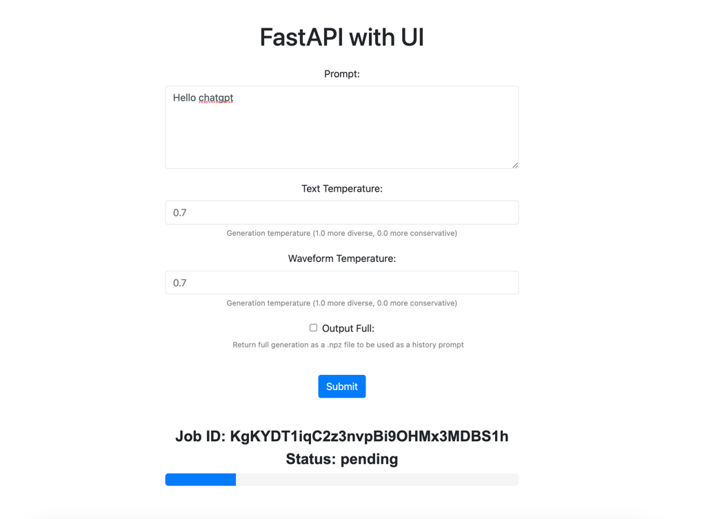
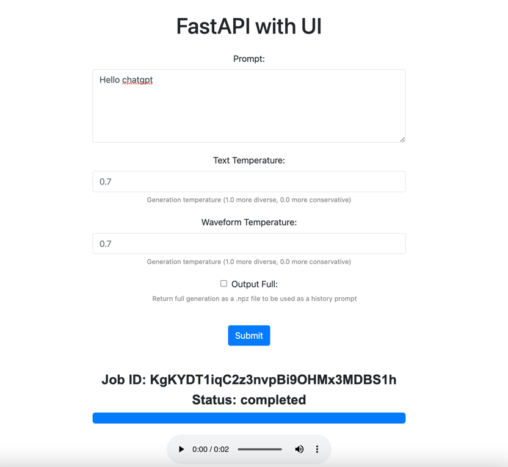

# Bark-Docker

This repository provides a professional-grade Docker container for the "Bark" GitHub repository. It utilizes FastAPI to create a robust API endpoint that receives prompts as requests and passes them on to the Bark repository for efficient processing. The API then returns the processed results as responses, enabling seamless integration with Bark functionalities. This Docker container enables you to effortlessly deploy and utilize a fully-functional API for Bark.

## Objective
The main objective is to utilize the suno-ai/bark repository, a cutting-edge text-to-audio transformer model. This repository includes both a user interface (UI) and API endpoints, allowing us to fully utilize the capabilities of the model. By integrating the API into our organization's products, we can enhance our offerings with high-quality text-to-audio functionality.

To facilitate easy deployment, I have also written a Dockerfile, enabling us to host the model within a container on our server. This ensures efficient and scalable usage of the model. Additionally, the UI I have created provides a user-friendly interface to interact with the model through the appropriate API endpoints.

Furthermore, the model can be further improved by training and developing it with our own voice data. This customization allows us to tailor the output to match our specific requirements and create a unique audio experience.

Overall, the suno-ai/bark repository offers a powerful text-to-audio transformer model, along with the necessary components for easy integration and customization within our organization's products.

## Sample




## Installation

Follow these steps to install and set up the Bark-Docker:

1. Clone this repository:
   ```shell
   git clone https://github.com/your-username/bark-docker.git
   ```

2. Install the required dependencies:
   ```shell
   pip install -r requirements.txt
   ```

3. Install Bark from the official repository. You can either clone it or install it directly using the following command:
   ```shell
   pip install git+https://github.com/suno-ai/bark.git
   ```

4. Specify the location for preloading trained models by setting the `XDG_CACHE_HOME` environment variable. You can choose your preferred location. For example, to set it to a subdirectory named `cache`, use the following command:
   ```shell
   export XDG_CACHE_HOME=cache/
   ```
   **Note:** By default, the models are saved locally in the Users/Home/... directory. The code will efficiently utilize available GPUs for processing.

5. To use the trained models, you can either preload them or download them manually:

   - Preload the models using the following Python code snippet:
     ```python
     from bark import SAMPLE_RATE, generate_audio, preload_models

     # Download and load all models
     preload_models()
     ```

   - Download the models manually from [https://huggingface.co/suno/bark/tree/main](https://huggingface.co/suno/bark/tree/main) and move them to your `XDG_CACHE_HOME/suno/bark_v0` directory.

6. Once the models are preloaded, run the following command to start the API:
   ```shell
   uvicorn main:app --reload
   ```

## API Usage

The API I created supports asynchronous processing, allowing concurrent users to effectively utilize its capabilities. The API behaves as a job queue, enabling efficient handling of multiple requests.

To submit a request, send a POST request to `http://127.0.0.1:8000/audio` with the following JSON format:

**Note:** Only the `prompt` field is required; others are optional.

```curl
curl --location 'http://127.0.0.1:8000/audio' \
--header 'Content-Type: application/json' \
--data '{
    "prompt": "Mass",
    "text_temp":0.7,
    "waveform_temp":0.7,
    "output_full":"False"
}'
```

The response will contain a job ID and its status:

```json
{
    "job_id": "ExNg544vfj3MzbTp4wGkdnQGgOUlYo",
    "status": "pending",
    "track_your_job": "/audio/ExNg544vfj3MzbTp4wGkdnQGgOUlYo"
}
```

To track the status of a job, send a GET request to `/audio/{job_id}` or click on the `track_your_job` link from the above response:

```curl
curl --location 'http://127.0.0.1:8000/audio/ExNg544vfj3MzbTp4wGkdnQGgOUlYo'
```

The response will be like below until the job is completed.
```json
{
    "job_id": "ExNg544vfj3MzbTp4wGkdnQGgOUlYo",
    "status": "pending",
    "audio_url": null
}
```

Once the job is complete, the response will contain the audio URL:

```json
{
    "job_id": "ExNg544vfj3MzbTp4wGkdnQGgOUlYo",
    "status": "completed",
    "audio_url": "/audio_files/ExNg544vfj3MzbTp4wGkdnQGgOUlYo.wav"
}
```

Click on the `audio_url` to listen to the generated audio.

**Note:** If you are running the API on a different location, replace `http://127.0.0.1:8000` with the appropriate host and port.

## Optimized Image - Docker

To optimize the Docker image, two Dockerfiles are provided:

Dockerfile1:

```Dockerfile
# Stage 1: Build dependencies and clone repository
FROM python:3.9-slim as builder

RUN apt-get update \
    && apt-get install -y --no-install-recommends git \
    && rm -rf /var/lib/apt/lists/*

WORKDIR /app

COPY requirements.txt /app/requirements.txt
RUN pip install --no-cache-dir -r requirements.txt \
    && pip install git+https://github.com/suno-ai/bark.git

# Copy the necessary files
COPY cache /app/cache
COPY main.py /app/main.py
COPY audio_files /app/audio_files

# Stage 2: Final image
FROM python:3.9-slim

WORKDIR /app

COPY --from=builder /app /app

# Set environment variables
ENV XDG_CACHE_HOME=cache/

EXPOSE 8000

CMD ["uvicorn", "main:app", "--host", "0.0.0.0", "--port", "8000"]
```
in the above Dockerfile, consists of two stages: "builder" and "final image." 
### Benefit of using two stages:

Reduced image size: By using multiple stages, you can discard unnecessary dependencies and files from the final image. The builder stage installs the required dependencies but is not included in the final image, resulting in a smaller image size.

Dockerfile2:

```Dockerfile
# Use a smaller base image
FROM python:3.9-alpine

# Install git and other dependencies
RUN apk --no-cache add git

# Set the working directory
WORKDIR /app

# Copy the necessary files
COPY cache /app/cache
COPY main.py /app/main.py
COPY audio_files /app/audio_files
COPY requirements.txt /app/requirements.txt

# Install dependencies
RUN --mount=type=cache,target=/root/.cache \
    pip install --no-cache-dir -r requirements.txt \
    && pip install git+https://github.com/suno-ai/bark.git

# Set environment variables
ENV XDG_CACHE_HOME=cache/

EXPOSE 8000

# Set production mode environment variable
ENV PYTHONBUFFERED=1

# Run the application
CMD ["uvicorn", "main:app", "--host", "0.0.0.0", "--port", "8000"]

```
To build the optimized Docker image, execute the following command:

```shell
docker build -t myapp:latest .
```

To run the Docker container and expose the API on port 8000, execute the following command:

```shell
docker run -p 8000:8000 myapp:latest
```

Once the container is running, you can use the Bark API as described above.